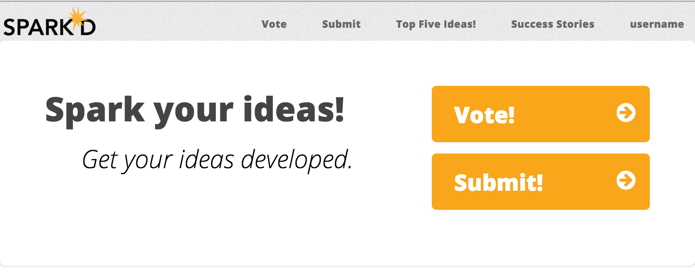
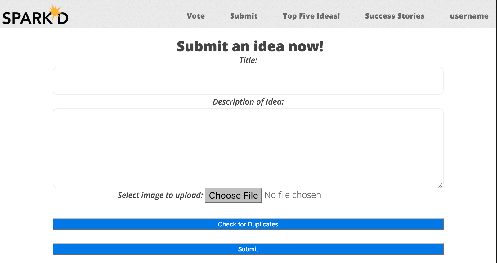
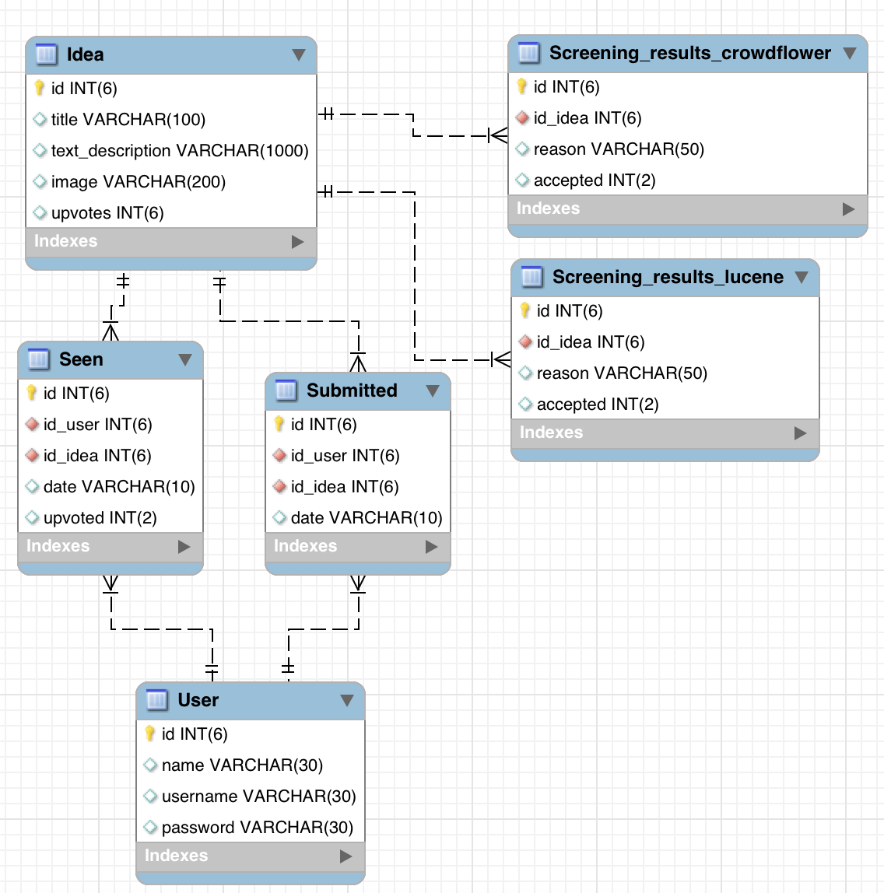

##Information Retrieval Group Project - Sparked
TU Delft, Masters Software Technology, Information Retrieval, 3rd Quarter 2015

###Application Summary
In this assignment, our group built the application "Sparked". The purpose of Sparked is to **crowdsource ideas for mobile applications**. The application would generate the applications most desired by the crowd with the idea that the applications could then be created and sold.

This assignment was meant to showcase the use of three relevant technologies: **crowdsourcing, human computation, and information retrieval**

| Tech   | Usage in Sparked  |
| ------ |:------------------| 
| Crowdsourcing |Crowdsourcing is the backbone of the Sparked application. We use the crowd to submit new mobile ideas. Users can submit ideas with a title, description, and image. Ideas are submitted through a PHP form and stored in a MySQL database. Crowdsourcing is also used to find the best ideas in the submissions. Users can browse through ideas and upvote or downvote them as they go. | 
| Human Computation   | Human computation is the idea of using human beings to complete tasks rather than using software. Here we use human computation through [CrowdFlower](http://www.crowdflower.com/) to check user-submitted images. CURL requests are used to send information between crowdflower and our application.  | 
| Information Retrieval | Since the course is called *Information Retrieval*, we need to include an information retrieval component in our application. We used a "[more like this](https://wiki.apache.org/solr/MoreLikeThis)" query to allow users to see if ideas similar to their already exist in the database.| 

###User Interface at a Glance
The interface is fully responsive thanks to the [html template](http://html5up.net/verti) we used. 

The homepage shows users where to submit new ideas or vote on existing ones.



The submission page has a few fields and allows for image uploading.



###Deploying
Clone the repository in your web directory

```
git clone https://github.com/alex9311/Information-Retrieval.git
````
#####MySQL Database
You will need a SQL server and existing DB to connect to. Your credentials should be put in the [database/db_creds.php](database/db_creds.php) file.

Once this is done, you can set up the database by running the [reset script](database/resetdb.php) with

```
php database/resetdb.php
```
This will set up the following schema in your database



If you like, you can now populate the DB with some toy data. 

#####SOLR Database


###Contents of Repo
| Directory | Description |
|-----------|------------|
| [app](app)| This is where the Sparked app lives. It is a simplistic responsive PHP web app. |
| [database](database)| This is where the scripts used to manage the Sparked MySQL database live. Using these scripts, developers can wipe the database or repopulate it with a given CSV file. The database can also be easily exported to CSV format here. |
| [documents](documents) | This directory contains all of the documents created for the purpose of our course. This includes our "project idea document" and our final presentation slideshow. |
| [evaluation-similarity-check](evaluation-similarity-check) | When developing the application, we weren't sure what tool we wanted to use for our similarity checker. This directory contains the work we did and code used to evaluate Dandelion, Lucene, and RapidMiner. |
| [itunes-app-store-crawler](itunes-app-store-crawler) | This directory contains an iTunes web crawler we used and modified for our purposes. We used this application data to test our search functionality. |

